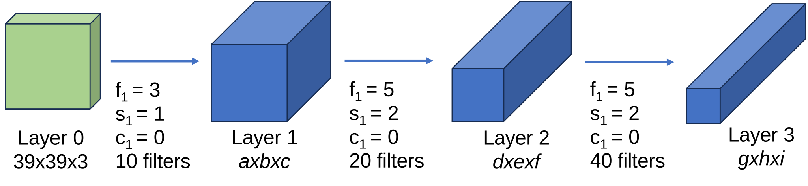

# Convolutional Neural Networks (CNN)

Convolutional Neural Networks (CNNs) are specifically tailored for computer vision tasks (classification, detection, segmentation, synthesis, etc.) (See Chapter 10.1 [[FDL2023]](https://www.bishopbook.com)). In 1989, LeCun proposed LeNet, a CNN for recognizing handwritten digits in images that was trained by backpropagation. It was widely recognised as the first CNN model achievieng outstanding results matching the performance of support vector machines, then a dominant approach in supervised learning. It laid the foundation for modern CNN architectures and demonstrated the power of convolutional layers and their ability to learn spatial hierarchies of features in an image, a principle that remains central in modern CNNs used for more complex tasks in computer vision.  

However, CNNs got popular in 2012 when outperformed other models at ImageNet Challenge Competition in object classification/detection (here you can see a visualization hierarchy of [1000 classes](https://observablehq.com/@mbostock/imagenet-hierarchy) from ImageNet). Specifically, the first CNN to achieve a breakthrough in the ImageNet Challenge was AlexNet (designed by Alex Krizhevsky, Ilya Sutskever, and Geoffrey Hinton). It significantly outperformed the other competitors in the 2012 challenge, reducing the error rate by a large margin compared to traditional image classification methods (see here the [results](https://image-net.org/challenges/LSVRC/2012/results.html). 

Today, the [results](https://paperswithcode.com/sota/image-classification-on-imagenet) of the DNN (including CNNs and others as Visual Transformers) in ImageNet Challege Competion are achieving amazing results (more than 95% Top-1 accuracy).  

## Objectives

* O1. Know and implement the fundamental components that conform a CNN.
* O2. Learn about modern convolutional networks that have set milestones in design aspects and how to train them

## 1.  First session of this block (6th February 2026)

### Contents to prepare before (online)

The contents of this first session are related to the objetive 1, being the following:

#### 1.1 Introduction
	[This part can take about 1 hour 🕒️ of personal working.]

* Convolutions 
	* Convolution (or cross-correlation operation): [[DDL23, Section 7.1.3]](https://d2l.ai/chapter_convolutional-neural-networks/why-conv.html#convolutions)
	* Examples of kernels: [image kernels](https://setosa.io/ev/image-kernels/)

	

* Why CNN? [[UDL2023, Section 10 at beginning]](https://udlbook.github.io/udlbook/),[[DDL23, Section 7.1]](https://d2l.ai/chapter_convolutional-neural-networks/why-conv.html#from-fully-connected-layers-to-convolutions), [[DDL23, Section 7.1.2]](https://d2l.ai/chapter_convolutional-neural-networks/why-conv.html#constraining-the-mlp).
	* Reduction of learning parameters 
	*  Invariance: [[UDL2023, Section 10.1]](https://udlbook.github.io/udlbook/), [[DDL23, Section 7.1.2.1]](https://d2l.ai/chapter_convolutional-neural-networks/why-conv.html#invariance)
	* Locality principle: [[DDL23, Section 7.1.2.2]](https://d2l.ai/chapter_convolutional-neural-networks/why-conv.html#locality)

	**_NOTE_:** 
	**You don't need to go deeper into the mathematical formulation**

* Architecture of a CNN: a typical CNN has 4 layers: Input layer, Convolution layer, Pooling layer and Fully connected layer. 

#### 1.2 Convolutional layer

	[This part can take about 2 hours 🕒️ of personal working.]

A convolutional layer is the fundamental building block of a CNN. It is able to detect features such as edges, textures, or more complex patterns in higher layers from the input images, extracting characteristics from the previous layers (input layer, previous convolutions,…). A very interesting description of these layers could be found in this [web](https://towardsdatascience.com/intuitively-understanding-convolutions-for-deep-learning-1f6f42faee1). It includes the following concepts:

* Padding: Image (n,m), filter (f,f), padding p -> Out (n+2*p-f+1, m+2*p-f+1)
* Strides: Image (n,m), filter (f,f), padding p, stride s -> floor((n+2*p-f)/s+1), floor((m+2*p-f)/s+1)
* Convolutions over volumes
* Multiple filters

After the convolution operation, the non-linearity is introduced by an **activation function** (Sigmoid, ReLU, etc.). It allows to learn more complex patterns.

Some of the contents are extracted from this paper. A summarized version of the concepts can be found in the section 10.2 (except 10.2.6 and 10.2.8) from [[FDL2023]](https://www.bishopbook.com). Finally, to go in depth with these concepts, I recomnend you to read the section [Convolutions for images](
https://d2l.ai/chapter_convolutional-neural-networks/conv-layer.html#convolutions-for-images), [Padding and Stride](https://d2l.ai/chapter_convolutional-neural-networks/padding-and-strides.html#padding-and-stride) and [Multiple Input and Multiple Output](https://d2l.ai/chapter_convolutional-neural-networks/channels.html#multiple-input-and-multiple-output-channels) from the Chapter 7 of the [[DDL2023]](https://D2L.ai) book.

**Notes:** 

* The result of a convolution filter with size \((f \cdot f\)) to an image of \((h,w)\) size with a padding \(p\) is:
	\(\left((h+2p-f)+1, (w+2p-f)+1)\right)\)
* The result of a convolution filter with size \((f \cdot f\) to an image of \((h,w)\) size with a padding \(p\) and a stride of \(s\) is: \( \lfloor \frac{h+2p-f}{s}+1 \rfloor, \lfloor \frac{w+2p-f}{s}+1 \rfloor \)
* Let \(c_{l-1}\) the number of channels of the previous layer \(l\) of a convolutonal layer, \(f\) the filter height and widht and \(c\) the number of filters in the layer. The number of parameters of the convulational layer is: \((f \cdot f \cdot c_{l-1} + 1) \cdot c_l\)

##### Exercise

1. Calculate the size of the filters of the different layers (a,b,c), (d,e,f) and (g,h,i) of the following image:

#### 1.3 Pooling layer

	[This part can take about 1 hour 🕒️ of personal working.]

The main function of the pooling layer is to reduce the spatial dimensions (i.e., width and height) of the input volume for the next convolutional layer. This reduction is achieved without affecting the number of filters in the layer. The pooling operation provides several benefits:

1. **Reduction of computation**: By reducing the dimensions of the feature maps, pooling layers decrease the number of parameters and computations in the network, leading to improved computational efficiency.
1. **Reduction of Overfitting**: Smaller input sizes mean fewer parameters, which can help reduce the overfitting in the network.
1. **Invariance to Transformations**: Pooling helps the network to become invariant to small transformations, distortions, and translations in the input image. This means that the network can recognize the object even if it's slightly modified in different input images.

There are several types of pooling, but the most common are:

- Max Pooling
- Average Pooling

A more detailed explanation could be found in the [Pooling section](https://d2l.ai/chapter_convolutional-neural-networks/pooling.html#pooling) from the Chapter 7 of the [[DDL2023]](https://D2L.ai) book.

**Notes:** 

* There is not parameters to learn!

### Contents for the presential class
In the laboratory class (2 hours 🕒️ duration), we will see how certain components of a convolutional neural network are implemented .

The aim is for the notebooks to be studied and modified. A later class will present a more advanced practice that will involve modifying and implementing CNN code.

## 2.  Second session of this block (13th February 2026)

### Contents to prepare before (online)

The contents of this first session are related to the objetive 2, being the following:

#### 2.1 Introduction

	[This part can take about 0,5 hours 🕒️ of personal working.]

A typical CNN has several convolution plus pooling layers, each responsible for feature extraction at different levels of abstraction: filters in first layer detect horizontal, vertical, and diagonal edge; filters in the next layer detect shapes; filters in the following layers detect collection of shapes, etc.

A good starting point to understand the architecture of a simple CNN is to study the [LeNet model](https://d2l.ai/chapter_convolutional-neural-networks/lenet.html#convolutional-neural-networks-lenet) designed in the 90s. LeNet, one of the earliest convolutional neural networks, was designed by Yann LeCun et al. for handwritten and machine-printed character recognition. It laid the groundwork for many of the CNN architectures that followed. LeNet is relatively small by today's standards, with approximately 60K parameters. This makes it computationally efficient and easy to understand. LeNet's architecture reduces width and height dimensions through its layers, while increasing the depth (number of filters). This reduction is achieved through the use of convolutional layers with strides and pooling layers, which also help in achieving spatial invariance to input distortions and shifts. The composition of layers is:

* `Input Layer`: The original LeNet was designed for 32x32 pixel input images.
* `Convolutional Layer`: The first convolutional layer uses a set of learnable filters. Each filter produces one feature map, capturing basic features like edges or corners. 
* `Pooling Layer`: Follows the first convolutional layer, reducing the spatial size (width and height) of the input volume for the next convolutional layer, reducing the number of parameters and computation in the network, and hence also controlling overfitting.
* `Convolutional Layer`: A second convolutional layer that further processes the features from the previous pooling layer, detecting higher-level features.
* `Pooling Layer`: this layer further reduces the dimensionality of the feature maps.
* `Fully Connected Layer`: The flattened output from the previous layer is fed into a fully connected layer that begins the high-level reasoning process in the network.
* `Fully Connected Layer`: An additional fully connected layer to continue the pattern analysis from the previous layer, leading to the final classification.
* `Output Layer`: The final layer uses a softmax to output the probabilities for each class.

**Notes**
* In some versions of LeNet, the sigmoid function and the hyperbolic tangent (tanh) function were used as the activation function in the convolutional and fully connected layers. 

##### Exercise

1. Calculate the number of the learning parameters of LeNet architecture

#### 2.2. Classic networks

	[This part can take about 1 hour 🕒️ of personal working.]

* Alexnet: [[DDL23, Section 8.1]](https://d2l.ai/chapter_convolutional-modern/alexnet.html#alexnet)
	* AlexNet represents a significant milestone in the development of convolutional neural networks and played a pivotal role in demonstrating the power of deep learning for image recognition tasks.
	* It was significantly larger and deeper than its predecessors like LeNet (with about 60M parameters).  This increase in scale allowed AlexNet to capture more complex and abstract features from images, contributing to its superior performance.
	* It was one of the first CNNs to successfully use ReLU activation functions instead of the sigmoid or tanh functions that were common at the time. ReLUs help to alleviate the vanishing gradient problem, allowing deeper networks to be trained more effectively.
	* It introduced overlapping pooling, where the pooling windows overlap with each other, as opposed to the non-overlapping pooling used in earlier architectures like LeNet. This was found to reduce overfitting and improve the network's performance.
	* It introduced data augmentation techniques such as image translations, horizontal reflections, and alterations to the intensities of the RGB channels.
	* Layers:
		* `Input Layer`: The network accepts an input image size of 227x227 pixels with 3 color channels (RGB).
		* `First Convolutional Layer (Conv1)`: It uses 96 kernels of size 11x11 with a stride of 4 and applies ReLU activation. This large kernel size is chosen for the first convolutional layer to capture the low-level features from the larger input image.
		* `Max Pooling Layer`: kernel size of 3x3 and a stride of 2.
		* `Second Convolutional Layer (Conv2)`: It has 256 kernels of size 5x5, with padding applied to preserve the spatial dimensions. ReLU activation is used.
		* `Max Pooling Layer`: kernel size of 3x3 and a stride of 2.
		* `Third Convolutional Layer (Conv3)`: It has 384 kernels of size 3x3, with padding and ReLU activation.
		* `Fourth Convolutional Layer (Conv4)`: Similar to Conv3, it has 384 kernels of size 3x3 with padding and ReLU activation.
		* `Fifth Convolutional Layer (Conv5)`: It has 256 kernels of size 3x3, again with padding and ReLU activation.
		* `Max Pooling Layer`: kernel size of 3x3 and a stride of 2.
		* `Fully Connected Layer (FC6)`: This dense layer has 4096 neurons and includes ReLU activation and dropout with a dropout rate of 0.5 to prevent overfitting.
		* `Fully Connected Layer (FC7)`: Also consists of 4096 neurons with ReLU activation and dropout.
		* `Fully Connected Layer (FC8)`: / The final FC layer has 1000 neurons (corresponding to the 1000 classes in the ImageNet challenge) 
		* `Output layer`: Softmax activation function to output the probability distribution over the classes.

* VGG-16 [[DDL23, Section 8.2]](https://d2l.ai/chapter_convolutional-modern/vgg.html)
	* VGG-16, developed by the Visual Graphics Group (VGG) at Oxford, is known for its simplicity and depth. It was a runner-up in the 2014 ImageNet competition.
	* The architecture's significant number of parameters (138M) makes it prone to overfitting, which is mitigated by using dropout and data augmentation techniques.
	* The model is characterized by its use of 3x3 convolutional layers stacked on top of each other in increasing depth.
	* It has an uniform architecture consistent of using 3x3 convolutional filters and 2x2 max-pooling layers throughout the network
	* It duplicate filters, starting at 64, doubles after each max-pooling layer, following the sequence 64, 128, 256, 512, 512
	* Layers:
		* `Input Layer`: size 224x224 pixels with 3 channels (RGB)
		* `Conv1`: 2x [Conv3x3-64] + MaxPool (2x2, stride 2)
		* `Conv2`: 2x [Conv3x3-128] + MaxPool (2x2, stride 2)
		* `Conv3`: 3x [Conv3x3-256] + MaxPool (2x2, stride 2)
		* `Conv4`: 3x [Conv3x3-512] + MaxPool (2x2, stride 2)
		* `Conv5`: 3x [Conv3x3-512] + MaxPool (2x2, stride 2)
		* `FC1`: 4096 neurons, ReLU activation
		* `FC2`: 4096 neurons, ReLU activation
		* `FC3`: 1000 neurons (for 1000 ImageNet classes), Softmax activation

#### 2.2. Residual networks

	[This part can take about 0,5 hours 🕒️ of personal working.]

* ResNet [[FDL2023, Section 9.5]](https://www.bishopbook.com), [[TDS]](https://towardsdatascience.com/residual-networks-resnets-cb474c7c834a),[[DDL2023, Section 8.6]](https://d2l.ai/chapter_convolutional-modern/resnet.html#residual-networks-resnet-and-resnext)
	* ResNet (Residual Network) was introduced by He et al. in 2015 and won the ImageNet competition by a significant margin.
	* It addresses the vanishing gradient problem in deep neural networks through the use of residual blocks, enabling the training of networks that are much deeper than previous architectures. This is by using shortcut connections that allow gradients to flow through the network more effectively. his approach allows for the construction of very deep networks (ResNet variants come in depths of 50, 101, 152 layers, and more) without degradation in performance due to vanishing gradients.
	* The core building block of ResNet that enables the network to learn identity functions, ensuring that deeper layers can at least perform as well as shallower ones.
	* A **residual block** allows the input to a series of layers to be added to their output, facilitating the learning process by allowing the network to learn modifications to the identity mapping rather than the entire transformation from scratch. It is composed by:
		* Shortcut Connection that skips one or more layers.
		* Two or three convolutional layers, each followed by batch normalization and a ReLU activation function.
		* The output of the weighted layers is added to the shortcut connection's output. If the input and output dimensions are the same, the shortcut connection directly adds the input \(x\) to the output of the convolutional layers \(F(x)\), resulting in \(F(x) + x\). If the dimensions of \(x\) and \(F(x)\) do not match, a linear projection \(W_s\) is applied to \(x\) through a convolutional operation to match the dimensions. The resulting output is \(F(x) + W_s x\).
	* Layers of ResNet-34:
		* `Input Layer`: size 224x224 pixels with 3 channels (RGB) 
		* `Convolutional Layer`: 7x7 convolutions, 64 filters, stride of 2, ReLU Activation
		* `Max Pooling`: 3x3, stride of 2
		* `Residual blocks`: The blocks in each stage have the same number of filters, but the number of filters increases as the network deepens.
			* 3 Basic Residual Blocks: Each block has two 3x3 convolutional layers with 64 filters each. Shortcut connections add the input of the block to its output without any modification since the dimensions match.
			* 4 Basic Residual Blocks: Each block has two 3x3 convolutional layers with 128 filters each. The first block uses a stride of 2 for down-sampling and a 1x1 convolution in the shortcut connection to match the increased depth.
			* 6 Basic Residual Blocks: Each block has two 3x3 convolutional layers with 256 filters each. Similar to the previous stage 2, the first block uses a stride of 2 for down-sampling, and the shortcut connection includes a 1x1 convolution to match the depth.
			* 3 Basic Residual Blocks: Each block has two 3x3 convolutional layers with 512 filters each. Again, the first block in this stage applies a stride of 2 for down-sampling, and the shortcut connection includes a 1x1 convolution to match the depth.
		* `Global Average Pooling`: Applied after the last convolutional block to reduce spatial dimensions to 1x1.
		* `Fully Connected Layer`: Ends with a fully connected layer with 1000 neurons (for the 1000 classes of the ImageNet dataset), followed by a softmax activation for classification.

[From He et al. 2015]

**Note:**

* [1x1 convolution](https://medium.com/analytics-vidhya/talented-mr-1x1-comprehensive-look-at-1x1-convolution-in-deep-learning-f6b355825578): 1X1 Conv are used to increase/reduce the number of channels while introducing non-linearity.

#### 2.3. Inception

	[This part can take about 0,5 hours 🕒️ of personal working.]

The Inception architecture [[DDL 2023, Section 8.4]](https://d2l.ai/chapter_convolutional-modern/googlenet.html#multi-branch-networks-googlenet), particularly known from the GoogLeNet (Inception v1) model introduced in the 2014 ImageNet competition, is notable for its novel approach to convolutional network design. It introduced the "Inception module," a building block that allows the network to choose from different filter sizes and operations within the same layer. Some important notes:

* The Inception architecture revolutionizes the design of convolutional layers by incorporating multiple filter sizes within the same module, allowing the network to adapt to various spatial hierarchies of features in images.
* The Inception module:
	* 1x1 Convolutions: To perform dimensionality reduction or increase, reducing the computational cost and the number of parameters in the network and to increase the network's ability to capture nonlinearities without a significant increase in computational complexity.
	* Multiple Filter Sizes: Within each Inception module, convolutional operations with different filter sizes (e.g., 1x1, 3x3, and 5x5) are performed in parallel to capture information from various spatial extents. The outputs of these parallel paths are concatenated along the channel dimension, allowing the network to decide which filters to emphasize for each new input.
	* Pooling: Inception modules also include a parallel pooling path, typically max pooling, followed by 1x1 convolutions to reduce dimensionality before concatenation.
	* Dimensionality Reduction: Before applying larger convolutions (e.g., 3x3 and 5x5), 1x1 convolutions are used for dimensionality reduction, decreasing the computational burden.
* The Inception modules' combination of parallel convolutional paths with different filter sizes and 1x1 convolutions for dimensionality management allows the network to be both wide (in terms of capturing a broad range of features) and deep (in terms of layers), while maintaining computational efficiency. This design philosophy has been extended and refined in subsequent versions of the Inception architecture, such as Inception v2, v3, and v4, each introducing further optimizations and improvements.

 [From Szegedy et al. 2014]

#### 2.4. Computational efficient networks

	[This part can take about 1 hour 🕒️ of personal working.]

* MobileNet [[Medium]](https://medium.com/@godeep48/an-overview-on-mobilenet-an-efficient-mobile-vision-cnn-f301141db94d)
	*  The key innovation is in their efficient architectural design, aimed at **reducing computational cost while maintaining high performance**, especially on mobile and embedded devices.
	* The core innovation is the use of **[depthwise separable convolutions](https://machinelearningmastery.com/using-depthwise-separable-convolutions-in-tensorflow/)**.
		* Instead of using standard convolutions, it employs depthwise separable convolutions, which use a standard convolution into a depthwise convolution and a 1x1 pointwise convolution.
		*The input is first processed by a depthwise convolution \((n_w \cdot n_h \cdot n_c)\), applying a single filter per input channel. This is followed by a pointwise convolution \((1 \cdot 1 \cdot n_c')\) convolutions that combines the outputs of the depthwise convolution, adjusting the depth as necessary.
		* The computational cost is significantly reduced compared to standard convolutions.

	* Example: 

For the following convolution, the number of calculations is `filter parameters` x `filter positions` x `humber of filters`. This is (3 x 3 x 3) x (10 x 10) x 5 = 13.500 operations.

In case, we would use depthwise separable convolutions, as in the following figure:

The number of calculations will be reduced. First, the depthwise convolutions are applied for each channel obtaining that the number of calculations is again `filter parameters` x `filter positions` x `humber of filters`. This is (3 x 3) x (10 x 10) x 3 = 2.700 operations. Moreover, the pointwise (1x1) convolution, would be: (1 x 1 x 3) x (10 x 10) x 5 = 1.500 operations. Added to the previous calculations, we have a total of 4.200 operations, about a 30% of the previous operations.

* MobileNetV2:
	* It introduces residual connections similar to those in ResNet, but within the framework of inverted residual blocks. These connections allow the input to bypass one or more layers, facilitating the flow of gradients during training and mitigating the vanishing gradient problem.
	* Inverted Residual Blocks
		* `Pointwise convolution`: Each block starts with a 1x1 convolution that expands the input's depth, increasing the representation capacity and allowing the network to learn more complex functions.
		* `Depthwise Convolution`: Follows the expansion layer, applying spatial filtering within each channel.
		* `Projection Layer`: A 1x1 convolution that projects the expanded feature map back to a lower dimension, reducing the size and computational cost of the feature map.
	* This expansion-projection strategy increases the network's expressiveness while keeping the computational cost low by expanding the feature space only temporarily within the block.

* EfficientNet [[Medium]](https://medium.com/mlearning-ai/understanding-efficientnet-the-most-powerful-cnn-architecture-eaeb40386fad):  
	* These architectures systematically scale up CNNs in a more structured manner to achieve better efficiency and accuracy. The key innovation of EfficientNet is the use of a compound scaling method that uniformly scales network **width**, **depth**, and **resolution** with a set of fixed scaling coefficients.
	* It is able to achieve state-of-the-art accuracy with significantly fewer parameters and FLOPs (floating-point operations per second) compared to previous architectures.

#### 2.5. Image augmentation

	[This part can take about 0,25 hours 🕒️ of personal working.]

Finally, [image augmentation](https://d2l.ai/chapter_computer-vision/image-augmentation.html#image-augmentation) is a technique used to enhance the diversity of a training dataset without actually collecting new images. This is achieved by applying a series of random transformations to the existing images in the dataset, such as rotations, translations, flips, scaling, shearing, and color variations. These transformations produce altered versions of the images, which help the model generalize better from the training data, making it more robust to variations it might encounter in real-world data.

The benefits are:
	* Enhanced Generalization: Augmentation increases the diversity of the training set, helping the model generalize better to unseen data.
	* Reduced Overfitting: By providing varied examples, it prevents the model from memorizing specific images.
	* Improved Robustnes: Models become more robust to variations in input data, such as different angles, lighting conditions, and occlusions.

### Contents for the presential class
In the laboratory class (2 hours 🕒️ duration), we will implement a convolutional neural network .

The aim is for the notebook to be modified.

## Biblography

### Textbooks

1. [[DDL2023]](https://D2L.ai) Zhang, Aston and Lipton, Zachary C. and Li, Mu and Smola, Alexander J. Dive into Deep Learning. Cambridge University Press (2023)
2. [[UDL2023]](https://udlbook.github.io/udlbook/) Simon J.D. Prince. Understandig Deep Learning. MIT Press (2023).
3. [[FDL2023]](https://www.bishopbook.com) Bishop, C.M., Bishop, H. (2024). Convolutional Networks. In: Deep Learning. Springer, Cham. https://doi.org/10.1007/978-3-031-45468-4_10 (2023)

### Webpages

* [https://cs231n.github.io/convolutional-networks/](https://cs231n.github.io/convolutional-networks/): CNN fundamentals
* [https://towardsdatascience.com/residual-networks-resnets-cb474c7c834a](https://towardsdatascience.com/residual-networks-resnets-cb474c7c834a): ResNet
* [https://medium.com/analytics-vidhya/talented-mr-1x1-comprehensive-look-at-1x1-convolution-in-deep-learning-f6b355825578](https://medium.com/analytics-vidhya/talented-mr-1x1-comprehensive-look-at-1x1-convolution-in-deep-learning-f6b355825578):1x1 convolution

### Others
* [https://arxiv.org/pdf/1603.07285.pdf](https://arxiv.org/pdf/1603.07285.pdf): Extra information for Convolutional parameters

