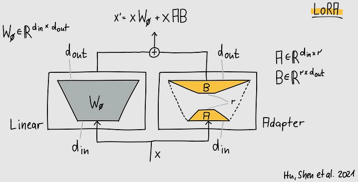
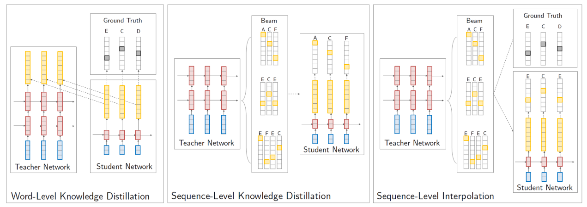

# Fine-tuning and model compression

## Fine-tuning

Fine-tuning is the process of taking a pre-trained model and updating its parameters with new data. This is a common practice in deep learning, where vision or language models are trained on large datasets and then fine-tuned on smaller datasets to adapt them to specific tasks. As you may know, the pre-training stage usually follows a self-supervised learning approach (image patching or token masking, for example), where the model is trained to predict some information already present in the data. In this way, the model learns to represent the data in a neutral manner that is useful for a wide range of tasks. Some pre-trained models are additionally fine-tuned on a supervised task, such as text-to-image generation, machine translation or instruction following, to name a few, but even in those cases the models can be further fine-tuned on more specific downstream task, such as generating manga-style images, translating new languages or acting as a conversational chatbot, for example.

Catastrophic forgetting is a phenomenon that occurs in neural networks, particularly evident during the fine-tuning process of deep learning models. It describes the tendency of neural networks to completely forget previously learned information upon learning new data. This is a significant challenge when adapting a pre-trained model to a new task (that is,   fine-tuning), as the model may lose its ability to perform well on the original tasks it was trained on. This is especially relevant when we want to keep the performance in the first task while improving the performance in the second task. To mitigate catastrophic forgetting, several techniques have been proposed. For example, a term may be added to the loss function that penalizes the probability distribution of the model's predictions differing from the original model's predictions; the Kulback-Leibler divergence is a common choice for this term. Another way to tackle catastrophic forgetting in multi-task learning scenarios is to mix the training data from the original and the new tasks, so that the model is trained on both tasks at the same time.

Another aspect to consider when fine-tuning a model is the choice of the parameters to re-learn. When fine-tuning pre-trained models such as BERT, it may suffice to re-learn only the predictor at the last layer while keeping the rest of the model frozen. In general, depending on the tasks, some layers may be frozen while others are trained. In other cases, it may be necessary to re-learn the entire model. No matter the case, a fine-tuning strategy known as low-rank adaptation (LoRA) significantly reduces the number of parameters to be fine-tuned, while maintaining the performance of the model. To illustrate how LoRA works, consider the situation in which the parameters of a matrix \(W_0\) of the pre-trained model needs to be fine-tuned. Instead of obtaining via gradient descent a new matrix of the increments \(\Delta W\) to be applied to \(W_0\), this matrix is approximated by two smaller matrices \(A\) and \(B\). The new parameters are then obtained as:

\[W_0 + \Delta W = W_0 + AB\]

where \(W_0\) is of dimension \(d \times k\), \(A\) is \(d \times r\), and \(B\) is \(r \times k\), with \(r \ll d\) and  \(r \ll k\). Note that \(A\) and \(B\) are of much smaller size than \(W_0\) and therefore fine-tuning is considerably faster. The hyperparameter \(r\) is usually set to a small power of 2 usually around 64 or less. The matrices \(A\) and \(B\) are initialized so that \(AB\) is close to zero at the beginning of training.

You may now distribute the so called LoRA adapters represented by the matrices \(A\) and \(B\) separately and merge their product with the original weights of the model at inference time. The adapters may easily be thousands of times smaller than the original weights. When fine-tuning a transformer model with LoRA, only a subset of the matrices are adapted (usually, those computing the query, key and value vectors in the self-attention mechanism), while the rest of the model is kept frozen. Fine-tuning can be even more memory efficient if LoRA is combined with quantization (see next section), resulting in the technique known as QLoRA.

## Model compression

As a result of using large training datasets, deep neural models often require a high number of parameters to learn adequate representations for a given task. However, it has been shown that these models tend to learn redundant representations, and this observation has sparked interest in developing smaller models that, in some cases, can achieve similar or even better results than their larger counterparts. These efforts to obtain smaller models are collectively referred to under the umbrella of model compression techniques. Note that training a large model is unavoidable in many cases, but the proposal here is to compress the model after training it, so that it can be deployed in resource-constrained environments.

Model compression techniques include the following ones: 

- *pruning*, where certain weights are zeroed out based on their importance, allowing for an efficient storage of the remaining weights in sparse matrices; other approaches prune entire layers; for example, the paper "[Analyzing Multi-Head Self-Attention: Specialized Heads Do the Heavy Lifting, the Rest Can Be Pruned](https://aclanthology.org/P19-1580/)" removes 38 out of 48 encoder heads in a transformer used for machine translation without significantly affecting the performance;
- *quantization*, which reduces the precision of the numerical values representing the weights, from 32-bit or 16-bit floating point numbers for each parameter to 8-bit integers; in some cases, the parameters may be represented with even fewer bits arriving to 4-bit, 2-bit and even 1-bit representations; quantization involves advanced techniques to determine the optimal quantization levels for each parameter, but their description is out of the scope of this course;
- *knowledge distillation*, which involves training a smaller "student" model to mimic the behavior of a larger "teacher" model, effectively transferring the knowledge without retaining the original model's size; next section analyzes this technique in more detail.

### Knowledge distillation

We will consider sequence-to-sequence models to present three approaches to knowledge distillation. In this case, the teacher model outputs a probability distribution over the target vocabulary, and the student model is trained to predict the same distribution. The next figure, taken from the [article](https://arxiv.org/abs/1606.07947) that introduced sequence-level knowledge distillation, depicts an overview of the various approaches to knowledge distillation. First, in word-level distillation (left), cross-entropy is minimized between student/teacher distributions (yellow) for each word in the actual target sequence (ECD) and between the student and the one-hot data distribution (black). In sequence-level distillation (center), the student is trained on the teacher's highest-scoring beam search output (ACF). For sequence-level interpolation (right), the student learns from the teacher's beam search output closest to the target sequence (ECE).

