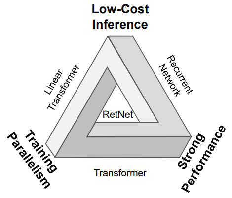

# Recurrent neural networks

Recurrent neural networks (RNNs) are a class of neural networks that are designed to work with sequences of data, such as time series, text or audio. Unlike transformers, which process the entire input sequence at once, RNNs process the input sequence one element at a time, while maintaining an internal state that encodes information about the elements processed so far. This internal state is updated at each step of the sequence, and used to inform the next layer (in the case of middle layers) or the output of the network in the case of the last layer. The first uses of RNNs can be traced back to the 1980s, but soon it was discovered that they were difficult to train due to the vanishing gradient problem, which made them unable to learn the long-term dependencies that happen in many sequences when the output at a given time step depends on the input at a much earlier time step. This problem was partially solved with the introduction of the *long short-term memory* (LSTM) units that were designed to replace conventional neurons in previous RNNs. However, the arrival of transformers in 2017 made RNNs less popular, although not completely obsolete. Recently, RNNs have experienced a resurgence of interest due to the development of new architectures and training techniques, such as the *receptance weighted key value* (RWKV) model, that have made them more efficient and easier to train.

## Recurrent neural networks

To learn more about RNNs, proceed to read chapter 9 of the book "Speech and Language Processing" by Daniel Jurafsky and James H. Martin following [:octicons-book-24: this link](https://web.archive.org/web/20240125024201/https://web.stanford.edu/~jurafsky/slp3/9.pdf). Note that the link points to an archived version of the book, as the book is not finished yet and chapter contents change frequently. Althoug RNNs can be applied to multiple types of sequences, the book focuses on their application to text. Nevertheless, you will not find it difficult to apply the concepts to other types of non-symbolic sequences such as numerical time series.

Firstly, study :octicons-book-24: sections 9.1 to 9.3 (estimated time: 🕑 2 hours). Mind some obsolete statements in the text, such as the claim at the end of section 9.3.3 that "this simple architecture underlies state-of-the-art approaches to applications such as machine translation, summarization, and question answering" which is no longer true. Except for the introduction of the recurrence in the architecture, most of the ideas (matrix multiplications to move from one vector space to another, activation functions, softmax predictors at the output, cross-entropy loss, representation of inputs as word embeddings, etc.) will not be new to you if you are already familiar with the basics of neural networks for natural language processing.  

## Long short-term memory

Skip section 9.4 and jump next to :octicons-book-24: section 9.5, which introduces the LSTM units, and lastly to section  :octicons-book-24: 9.6 (estimated time: 🕑 1 hour). Now, skim through the rest of the chapter for a couple of minutes only: you will see that encoder-decoder architectures are also viable with RNNs and that an attention mechanism (not exactly the same as the one used in transformers) can be used to determine which parts of the representations (states) learned by the encoder are more relevant to the decoder at each time step.

## Other recurrent or hybrid architectures

As already mentioned, a renaissance (or a [RNNaissance](https://people.idsia.ch/~juergen/rnnaissance.html) as some people called it when LSTM units were proposed in the late 1990s) of interest in RNNs has taken place recently motivated by the development of new architectures and training techniques that surpass some limitations of the transformer model. One of these limitations is the quadratic complexity of the self-attention mechanism, which makes it difficult to scale to very long sequences (context length) of thousands of tokens given the current memory capacity of GPUs. This quadratic complexity may be observed by considering that, given a sequence of length \(n\), the self-attention mechanism at each transformer head has to store \(n^2\) dot products. When used as generators of sequences at inference time, both architectures, RNN and transformers, have to process the sequence one token at a time, but at training time, the transformer can process the whole sequence at once in a parallel manner, while the RNN has to process it one token at a time to incrementally update its internal state. In addition to this, the softmax operation in the self-attention mechanism is also a bottleneck in terms of computational complexity; actually, different approaches have been proposed to mitigate (linearize) the impact of the softmax, thereby allowing for context lengths of up to one million tokens.

All the aforementioned issues have motivated the search for the holy grail of a model that combines the best performance with parallelizable training and efficient inference, as represented by the following image taken from the [retentive network](https://arxiv.org/abs/2307.08621) (RetNet) paper:

As an example, the RWKV (for *receptance weighted key value*, pronounced as *RWaKuV*) architecture combines efficient parallelizable training with the efficient inference capabilities of RNNs. This architecture employs a linear attention mechanism, enabling the model to be formulated as either a transformer or an RNN. This dual formulation allows for parallelized computations during training while maintaining constant computational and memory complexity during inference. Models based on RWKV with billions of parameters have been trained, resulting in the largest RNNs to date. In preliminary experiments, the RWKV architecture has been shown to be competitive with similarly sized transformers. 

Read a brief description of the RWKV architecture in this [:octicons-book-24: post](https://johanwind.github.io/2023/03/23/rwkv_overview.html) by Johan Sokrates Wind (estimated time: 🕑 30 minutes). We will not delve into the mathematical details of the RWKV architecture in this course, but see in the next figure a schematic representation of its underlying architecture which proves that it is not so different from the transformer architecture, at least at bird's eye view:

Optionally, if you are interested in the mathematical details, you can read the [original paper](https://arxiv.org/abs/2305.13048).

Recent times have also seen the development of other efficient architectures such as the already mentioned retentive networks or the [Mamba](https://arxiv.org/abs/2312.00752) model. The study of these architectures is out of the scope of this course and left as an exercise for the student.

### Additional techniques for speeding up neural networks

In parallel to the development of new architectures to overcome the limitations of transformers, scaling transformers to longer sequences is one of the most active research areas. Once the attention mechanism is identified as the primary bottleneck, techniques like FlashAttention exploit specific GPU memory characteristics to achieve significant memory savings and runtime acceleration without resorting to approximations, thereby preserving the integrity of the attention's calculations. Two notable techniques, FlashAttention and its more advanced successor FlashAttention-2, further leverage GPU properties to significantly enhance processing speeds, potentially increasing the speed of the models by factors of 4 to 8 times compared to models without these optimizations. These mechanisms are now integrated into many deep learning libraries.