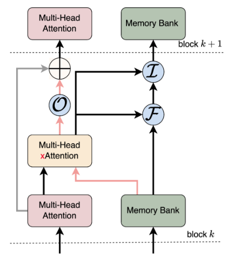
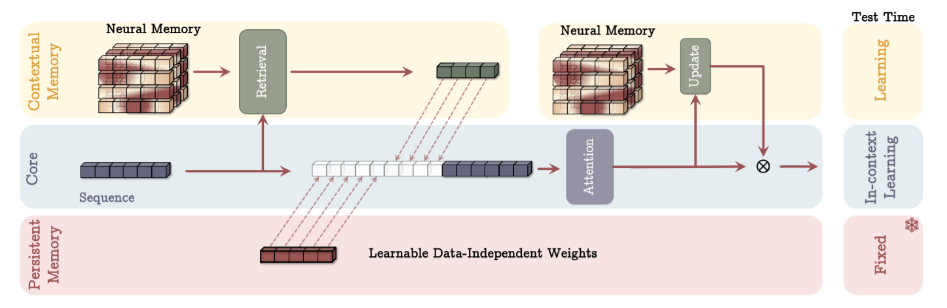

# Recurrent neural networks

Recurrent neural networks (RNNs) are a class of neural networks that are designed to work with sequences of data, such as time series, text or audio. Unlike transformers, which process the entire input sequence at once, RNNs process the input sequence one element at a time, while maintaining an internal state that encodes information about the elements processed so far. This internal state is updated at each step of the sequence, and used to inform the next layer (in the case of middle layers) or the output of the network in the case of the last layer. The first uses of RNNs can be traced back to the 1980s, but soon it was discovered that they were difficult to train due to the vanishing gradient problem, which made them unable to learn the long-term dependencies that happen in many sequences when the output at a given time step depends on the input at a much earlier time step. This problem was partially solved with the introduction of the *long short-term memory* (LSTM) units that were designed to replace conventional neurons in previous RNNs. However, the arrival of transformers in 2017 made RNNs less popular, although not completely obsolete. Recently, RNNs have experienced a resurgence of interest due to the development of new architectures and training techniques, such as the *receptance weighted key value* (RWKV) model, that have made them more efficient and easier to train.

## Recurrent neural networks

To learn more about RNNs, proceed to read chapter 9 of the book "Speech and Language Processing" by Daniel Jurafsky and James H. Martin following [:octicons-book-24: this link](https://web.archive.org/web/20240125024201/https://web.stanford.edu/~jurafsky/slp3/9.pdf). Note that the link points to an archived version of the book, as the book is not finished yet and chapter contents change frequently. Althoug RNNs can be applied to multiple types of sequences, the book focuses on their application to text. Nevertheless, you will not find it difficult to apply the concepts to other types of non-symbolic sequences such as numerical time series.

Firstly, study :octicons-book-24: sections 9.1 to 9.3 (estimated time: 🕑 2 hours). Mind some obsolete statements in the text, such as the claim at the end of section 9.3.3 that "this simple architecture underlies state-of-the-art approaches to applications such as machine translation, summarization, and question answering" which is no longer true. Except for the introduction of the recurrence in the architecture, most of the ideas (matrix multiplications to move from one vector space to another, activation functions, softmax predictors at the output, cross-entropy loss, representation of inputs as word embeddings, etc.) will not be new to you if you are already familiar with the basics of neural networks for natural language processing.  

## Long short-term memory

Skip section 9.4 and jump next to :octicons-book-24: section 9.5, which introduces the Hochreiter and Schmidhuber's LSTM units (first proposed in 1997), and lastly to section  :octicons-book-24: 9.6 (estimated time: 🕑 1 hour). Now, skim through the rest of the chapter for a couple of minutes only: you will see that encoder-decoder architectures are also viable with RNNs and that an attention mechanism (not exactly the same as the one used in transformers) can be used to determine which parts of the representations (states) learned by the encoder are more relevant to the decoder at each time step.

Although we will not delve into its details, the [xLSTM](https://arxiv.org/abs/2405.04517) architecture is a development proposed in 2024 that extends the LSTM architecture by introducing a new form of (exponential) gating mechanism and larger memory cells. The resulting model is able to capture longer-term dependencies and may even surpass transformers in some tasks while being more efficient in terms of computational resources.

## Key-value memories in neural networks

RNNs' state is a form of memory that is updated at each time step. In principle, specially when using LSTM cells, the states should be able to indefinitely store information from the past. However, in practice, the information stored in the state is limited by constraints in the architecture and the training process. This has led to the development of architectures that incorporate more explicit forms of memory, for example by using key-value memories. In this context, the key-value memory is a data structure that stores a set of key-value pairs, both represented as vectors; another vector known as the query is used to retrieve the value associated with a given key by computing the similarity between the query and the keys. In our settings, usually the query is not used to only retrieve one single key, but a combination of a number of keys weighted by their similarity to the query.

A lot of proposals exist on how to augment recurrent networks or transformers with more explicit memories in order to overcome some of the challenges they face when dealing with long-context reasoning, factual recall, and efficient storage of associative knowledge. The idea of incorporating memory into neural networks is not new and dates back to associative memories such as the *Hopfield networks* in the seventies and eighties, and, more recently, to the *neural Turing machines* and the [differentiable neural computers][dnc] (DNC) in the last decade. Here, we discuss a series of more recent approaches. 

[dnc]: https://jaspock.github.io/funicular/dnc.html

### Learned memory during training

In this [approach][metascale], memory contents are learned and fixed during training, and then used as-is during inference. The memory layer consists of learnable key-value pairs, which are stored as model parameters. These key-value pairs are optimized during training and remain unchanged during inference. Some of the feed-forward layers in the transformer blocks are replaced with memory layers, which retrieve relevant knowledge from the memory bank and incorporate it into the residual stream. It seems to be crucial to replace only some feed-forward layers with memory layers, as replacing all layers with memory-based mechanisms leads to suboptimal performance. Note that feed-forward networks already act as implicit associative memories by mapping inputs to outputs, but explicit memory layers perform a more direct selection of relevant knowledge from a structured key-value store with potentially millions of entries.

[metascale]: https://ai.meta.com/research/publications/memory-layers-at-scale/

A memory lookup operation follows the following steps. First, the input embedding is transformed into a query vector \(q\). Then, the top-\(k\) keys are selected from the memory bank by efficiently computing the dot-product similarity between the query and the keys. After this, the softmax function is applied to the dot products to obtain the relevance of each memory slot. Finally, the output is computed as a weighted sum of the values associated with the top-\(k\) keys.

### Read-write memory during inference

Unlike the previous approach, this method does not pre-train the memory values. Instead, it learns parameters that control what to store and retrieve dynamically during inference. The memory contents are updated as the model processes input sequences. DNCs are a well-known example of this. A more recent approach is the [LM2][lm2] model. Interestingly, the LM2 model works as an adaptation of the LSTM principles to memory-based models in the sense that it uses an input gate to control the amount of new information that is stored in the memory, a forget gate to control the amount of information that is kept from the previous memory state, and an output gate to control the amount of information that is read from the memory and used to update the output of the model.

[lm2]: https://arxiv.org/abs/2502.06049v1

In the LM2 model, the memory module consists of a bank of vector slots, each of which stores a simple vector rather than explicit key-value pairs. For each slot in the memory bank, learnable projection matrices are used to generate both keys and values. Similarly, input token embeddings are projected into query vectors via another learned linear transformation. Using the standard attention mechanism, queries are matched against keys to compute attention scores, which then weight the corresponding memory values to produce the output of the memory module \(E_{\text{mem}}\). Optionally, only the top-\(k\) memory slots may be considered when computing the output of the memory module. Note that \(E_{\text{mem}}\) integrates information from the
input and the memory.

The final output of the transformer block, \(E_{\text{out}}\), is computed by combining \(E_{\text{mem}}\) with the output of the standard self-attention mechanism:

\[
E_{\text{out}} = E_{\text{attn}} + E_{\text{gated}}
\]

where \(E_{\text{gated}}\) is the memory-modulated contribution, scaled by a learned scalar gate \( g_{\text{out}} \), which is obtained through another trainable projection:

\[
E_{\text{gated}} = g_{\text{out}} \cdot E_{\text{mem}}
\]

At each step, the memory state is updated dynamically as follows:

\[
M_{t+1} = g_{\text{in}} \cdot \tanh(E_{\text{mem}}) + g_{\text{forget}} \cdot M_t
\]

where:

- \( g_{\text{in}} \) and \( g_{\text{forget}} \) are learned gating functions obtained via trainable projection matrices,
- and \( M_t \) is the memory state at step \( t \).

This update rule determines how much of the retrieved memory content is incorporated into the new memory state and how much of the existing memory is retained.

### Recurrent memory transformer

Additionally, recent developments in memory-augmented transformers have introduced new architectures that further enhance long-context processing. The *recurrent memory transformer* (RMT) introduces a segment-level recurrent memory mechanism, allowing the model to store and transfer information across long sequences without modifying the core transformer structure. It achieves this by adding special memory tokens that persist across segments, effectively extending the model's context length. Building upon this, the [associative recurrent memory transformer][armt] (ARMT) enhances RMT by incorporating associative memory, enabling more efficient information storage and retrieval. This approach combines self-attention with memory updates, improving long-term reasoning and factual recall in extremely long-context tasks.

[armt]: https://arxiv.org/abs/2407.04841

### Titans: test-time long-term memory in neural networks

[Titans][titans] architecture, published in 2025, integrates a *hierarchical memory system* into a transformer framework, enabling efficient long-term storage and retrieval of past information. It introduces three interconnected memory components: *short-term attention-based memory*, which processes immediate dependencies; *long-term neural memory*, which retains historical context beyond the local window; and *persistent memory*, which stores task-specific knowledge. This layered memory design allows Titans to surpass conventional transformers in handling extensive sequences while maintaining fast inference and scalability.

A core innovation in Titans is its *memory decay mechanism*, which functions similarly to a forget gate in recurrent models. This decay selectively removes outdated information while preserving relevant past data, dynamically adapting based on the sequence. Unlike fixed-size memory compression methods in standard transformers, Titans utilize *adaptive decay functions* that regulate memory retention over time. This ensures that memory is continuously updated while preventing overflow, addressing a key limitation of long-context processing in transformers.

Titans employ a *surprise-based learning approach* to prioritize memory updates. When encountering new input, the model evaluates its divergence from expected patterns, using a gradient-based surprise metric to determine its relevance. Information that significantly deviates from learned patterns is reinforced in memory, while predictable or redundant data is gradually phased out. By incorporating this mechanism into transformer layers, Titans effectively balance memory utilization, allowing for both *dynamic adaptation and efficient long-term recall* within a scalable attention-based framework.

[titans]: https://arxiv.org/abs/2501.00663

## Other recurrent or hybrid architectures

As already mentioned, a renaissance (or a [RNNaissance](https://people.idsia.ch/~juergen/rnnaissance.html) as some people called it when LSTM units were proposed in the late 1990s) of interest in RNNs has taken place recently motivated by the development of new architectures and training techniques that surpass some limitations of the transformer model. One of these limitations is the quadratic complexity of the self-attention mechanism, which makes it difficult to scale to very long sequences (context length) of thousands of tokens given the current memory capacity of GPUs. This quadratic complexity may be observed by considering that, given a sequence of length \(n\), the self-attention mechanism at each transformer head has to compute and store \(n^2\) dot products. This means that the computation of every new next-token prediction is slower than the computation of the previous one. On the other hand, RNNs have a linear time complexity with respect to the sequence length and the memory requirements are constant, as they only need to store the current state. When used as generators of sequences at inference time, both architectures, RNN and transformers, have to process the sequence one token at a time, but at training time, the transformer can process the whole sequence at once in a parallel manner, while the RNN has to process it one token at a time to incrementally update its internal state. In addition to this, the softmax operation in the self-attention mechanism is also a bottleneck in terms of computational complexity; actually, different approaches have been proposed to mitigate (linearize) the impact of the softmax, thereby allowing for context lengths of up to one million tokens.

All the aforementioned issues have motivated the search for the holy grail of a model that combines the best performance with parallelizable training and efficient inference, as represented by the following image taken from the [retentive network](https://arxiv.org/abs/2307.08621) (RetNet) paper:

As an example, the RWKV (for *receptance weighted key value*, pronounced as *RaWKuV*) architecture combines efficient parallelizable training with the efficient inference capabilities of RNNs. This architecture employs a linear attention mechanism, enabling the model to be formulated as either a transformer or an RNN. This dual formulation allows for parallelized computations during training while maintaining constant computational and memory complexity during inference. Models based on RWKV with billions of parameters have been trained, resulting in the largest RNNs to date. In preliminary experiments, the RWKV architecture has been shown to be competitive with similarly sized transformers. 

Read a brief description of the RWKV architecture in this [:octicons-book-24: post](https://johanwind.github.io/2023/03/23/rwkv_overview.html) by Johan Sokrates Wind (estimated time: 🕑 30 minutes). We will not delve into the mathematical details of the RWKV architecture in this course, but see in the next figure a schematic representation of its underlying architecture which proves that it is not so different from the transformer architecture, at least at bird's eye view:

Optionally, if you are interested in the mathematical details, you can read the [original paper](https://arxiv.org/abs/2305.13048).

Recent times have also seen the development of other efficient architectures such as the already mentioned retentive networks or the *state-space* [Mamba](https://arxiv.org/abs/2312.00752)-like models (SSMs). Hybrid architectures will probably be the most common in the near future, as they can combine the best of different words. For example, the Griffin architecture combines recurrent and state space models (RecurrentGemma is a well known example of this architecture), whereas Jamba, Granite or Nemotron's combine Mamba-like SSMs with transformers. 

The study of these architectures is out of the scope of this course and left as an exercise for the student. It is also interesting to note that there are some theoretical studies that try to determine to which degree both architectures can be considered equivalent; for example, it has been [shown](https://arxiv.org/abs/2401.06104) that transformers can be conceptualized as a special case of RNNs with unlimited hidden state size.

### Additional techniques for speeding up neural networks

In parallel to the development of new architectures to overcome the limitations of transformers, scaling transformers to longer sequences is one of the most active research areas. Once the attention mechanism is identified as the primary bottleneck, techniques like FlashAttention exploit specific GPU memory characteristics to achieve significant memory savings and runtime acceleration without resorting to approximations, thereby preserving the integrity of the attention's calculations. Two notable techniques, FlashAttention and its more advanced successor FlashAttention-2, further leverage GPU properties to significantly enhance processing speeds, potentially increasing the speed of the models by factors of 4 to 8 times compared to models without these optimizations. These mechanisms are now integrated into many deep learning libraries.

# Time-series prediction

Traditionally, one of the most common applications of RNNs has been time-series prediction. In this context, RNNs are used to predict the next value of a time series given the previous values or to classify the time series into different categories. With the advent of transformers, the use of RNNs for time-series prediction has decreased, but they are still used in many cases, especially when transformer's complexity bottlenecks become a problem. In order to make the use of transformers practical for time-series prediction, some techniques have been developed to make the self-attention mechanism more efficient; they are complemented with the addition of more elaborated task-oriented positional embeddings (see, for example, the Informer model) that explicitly encode the time information (day, month, season, etc.) of the data. Nevertheless, traditional, non-neural and considerably simpler techniques such as ARIMA can never be discarded, at least as a baseline to compare the performance of more complex models with.

Starting from 2024, a number of pre-trained transformer models specifically designed for time-series prediction have been released, such as TimesFM, Chronos-2 or MOMENT. These models have been extensively trained on a wide variety of time-series datasets and exhibit strong zero-shot performance. 
