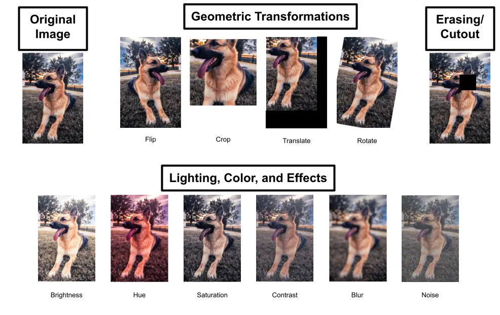
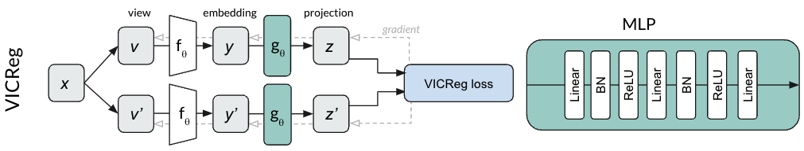

# Self-Supervised Learning

> Some of the following contents are adapted from the paper entitled _A Cookbook of Self-Supervised Learning_[@sslcookbook]. 

Self-Supervised Learning (SSL), dubbed “the dark matter of intelligence”, is a promising path to advance machine learning. As opposed to supervised learning, which is limited by the availability of labeled data, self-supervised approaches can learn from vast unlabeled data. 

SSL underpins deep learning’s success in natural language processing leading to advances from automated machine translation to large language models trained on web-scale corpora of unlabeled text. SSL methods for computer vision have been able to match or in some cases surpass models trained on labeled data, even on highly competitive benchmarks like ImageNet. SSL has also been successfully applied across other modalities such as video, audio, and time series.

> Self-supervised learning defines a pretext task based on unlabeled inputs to produce descriptive and intelligible representations. No labelled data is required for SSL, although the models used are actually supervised.

In natural language, a common SSL objective is to mask a word in the text and predict the surrounding words. This objective encourages the model to capture relationships among words in the text without the need for any labels. The same SSL model representations can be used across a range of downstream tasks such as translating text across languages, summarizing, or even generating text, along with many others. 

In computer vision, analogous objectives exist with models such as MAE or BYOL learning to predict masked patches of an image or representation. Other SSL objectives encourage two views of the same image, formed by say adding color or cropping, to be mapped to similar representations.

With the power to train on vast unlabeled data comes many benefits. While traditional supervised learning methods are trained on a specific task often known a priori based on the available labeled data, SSL learns generic representations useful across many tasks. SSL can be especially useful in domains such as medicine where labels are costly or the specific task can not be known a priori. There’s also evidence SSL models can learn representations that are more robust to adversarial examples, label corruption, and input perturbations—and are more fair—compared to their supervised counterparts. Consequently, SSL is a field garnering growing interest. 

Self-Supervised Contrastive Learning leverages the design of **pretext tasks**, which create positive and negative pairs from the unlabeled data. These pretext tasks are carefully designed to encourage the model to capture meaningful features and similarities in the data.

For this course, we are following the categorization in [@sslcookbook], in which methods are divided into three families:

* **Deep Metric Learning**
* **Self-Distillation**
* **Canonical Correlation Analysis**

A single model of each family is selected: SimCLR[@simclr], BYOL[@byol], and VicReg[@vicrec].

## The Deep Metric Learning Family: SimCLR/NNCLR/MeanSHIFT/SCL

The Deep Metric Learning (DML) family of methods is based on the principle of encouraging similarity between semantically transformed versions of an input. DML originated with the idea of contrastive loss, which transforms this principle into a learning objective.

To understand these methods, you should understand the basics of data augmentation and contrastive learning.

## Data Augmentation

Deep Metric Learning methods often begin with data augmentation, which involves applying various transformations or perturbations to unlabeled data to create diverse instances (also called augmented views).

The goal of data augmentation is to increase the variability of the data and expose the model to different perspectives of the same instance. Common data augmentation techniques include cropping, flipping, rotation, random crop, and color transformations. By generating diverse instances, contrastive learning ensures that the model learns to capture relevant information regardless of variations in the input data.

You can also chain the different techniques together:

> 💡 If you want to learn more about data augmentation, please read [this link](https://encord.com/blog/data-augmentation-guide/).

## Contrastive Learning

Contrastive learning leverages the assumption that similar instances should be closer together in a learned embedding space, while dissimilar instances should be farther apart. By framing learning as a discrimination task, contrastive learning allows models to capture relevant features and similarities in the data.

Contrastive Learning can be used in a Supervised or a Self-Supervised manner.

In the [Few-Shot Learning block](https://pertusa.github.io/ap/fsl/), we already used Contrastive Learning methods in a supervised way, using labelled data for training models explicitly to differentiate between similar and dissimilar instances according to their class. Therefore, the loss in this case tries to put together embeddings **from the same class**. The objective is to learn a representation space where instances from the same class are clustered closer together, while instances from other classes are pushed apart.

**Self-supervised contrastive learning**  takes a different approach by learning representations from unlabeled data without relying on explicit labels. 

Since no labels are available, to identify similar inputs, methods often form variants of a single input using known semantic preserving transformations via data augmentation.  The augmented samples are called views. The variants of the inputs are called positive pairs or examples; the samples we wish to make dissimilar are called negatives. So here, the loss tries to put together embeddings **from the same view** since we don't have information of the labels.

### SimCLR

[SimCLR](http://proceedings.mlr.press/v119/chen20j/chen20j.pdf)[@simclr], a Simple framework for Contrastive Learning of visual Representations, is a technique introduced by Prof. Hinton’s Group.

SimCLR learns representations by maximizing agreement between differently augmented views of the same data example via a contrastive loss in the latent space, as shown below.

SimCLR results were impressive, showing that  unsupervised learning benefits more from bigger models than its supervised counterpart.

> :octicons-book-24: Homework: Read [this post](https://amitness.com/2020/03/illustrated-simclr/#simclr-framework) to understand the basics of SimCLR. Estimated time: 🕑 0,5 hours.

## The Self-Distillation Family: BYOL/SimSIAM/DINO

Self-distillation methods such as BYOL, SimSIAM, DINO, along with their variants rely on a simple mechanism: feeding two different views to two encoders, and mapping one to the other by means of a predictor. To prevent the encoders from collapsing by predicting a constant for any input, various techniques are employed. A common approach to prevent collapse is to update one of the two encoder weights with a running average of the other encoder’s weights.

### BYOL (Bootstrap Your Own Latent)

[BYOL (bootstrap your own latent)](https://papers.nips.cc/paper/2020/file/f3ada80d5c4ee70142b17b8192b2958e-Paper.pdf)[@BYOL] introduced self-distillation as a means to avoid collapse. 

BYOL uses two networks along with a predictor to map the outputs of one network to the other. The network predicting the output is called the online or student network while the network producing the target is called the target or teacher network. Each network receives a different view of the same image formed by image transformations including random resizing, cropping, color jittering, and brightness alterations. 

The online (student) network is updated throughout training using gradient descent. The target (teacher) network is updated with an exponential moving average (EMA) updates of the weights of the online network. The slow updates induced by exponential moving average creates an asymmetry that is crucial to BYOL’s success.

BYOL achieves higher performance than state-of-the-art contrastive methods without using negative pairs at all. Instead, it uses two networks that learn from each other to iteratively bootstrap the representations, by forcing one network to use an augmented view of an image to predict the output of the other network for a different augmented view of the same image. 

BYOL almost matches the best supervised baseline on top-1 accuracy on ImageNet and beats out the self-supervised baselines.

> :octicons-book-24: Homework: Read [this post](https://www.casualganpapers.com/self-supervised-contrastive-representation-learning/BYOL-explained.html) to understand the basics of BYOL. Estimated time: 🕑 0,5 hours.

<!---ALTERNATIVE VIDEO, MEJOR CREO: https://www.youtube.com/watch?v=YPfUiOMYOEE --->

## The Canonical Correlation Analysis Family: VICReg/BarlowTwins/SWAV/W-MSE

The SSL canonical correlation analysis family originates with the Canonical Correlation Framework[@CCA]. The high-level goal of CCA is to infer the relationship between two variables by analyzing their cross-covariance matrices.

VICReg has the same basic architecture as its predecessors; augmented positive pairs are fed into Siamese encoders that produce representations, which are then passed into Siamese projectors that return projections.

However, unlike its predecessors, the model requires none of the following: negative examples, momentum encoders, asymmetric mechanisms in the architecture, stop-gradients, predictors, or even normalization of the projector outputs. Instead, the heavy lifting is done by VICReg’s objective function, which contains three main terms: a variance term, an invariance term, and a covariance term.

> :octicons-book-24: Homework: Read [this post](https://imbue.com/open-source/2022-04-21-vicreg/#vicreg) to understand the basics of VicReg. Estimated time: 🕑 0,5 hours.

